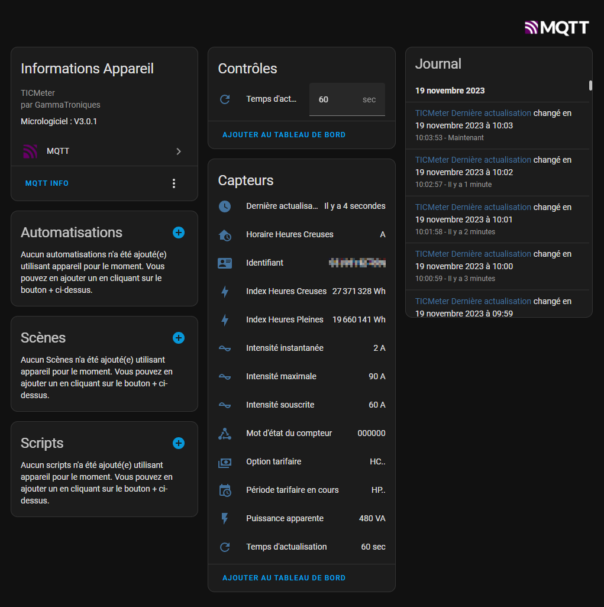

# TICMeter

## License

## About the project

**TICMeter** is a project to collect data from a **Linky meter** and send them to a **web server** or a **home automation server**. The system is powered by the pins A of the Linky meter and with the help of a supercapacitor.

- Work with :

- Compatible with :

- Created with : 

## Electronic

| Top Side | Bottom Side | PCB in the Linky meter |
|-----|-----|-----|
|  |  |  | 

#### PCB

| Top Side  | Bottom Side |
| ------------- | ------------- |
|  |  |

## Installation

#### ESP32 :satellite:
Compile and send [`firmware`](/esp32/src) files to the ESP32-C6

## Demo

#### Web example

#### MQTT example - Home Assistant

#### Zigbee example - Home Assistant

#### Tuya example

## Authors

- [@Dorian.local/](https://github.com/xmow49)
- [@Noah_](https://github.com/NoahJst)

>__Note__  
This program is still under development, it is possible that errors and problems are found in the code

:shipit:
