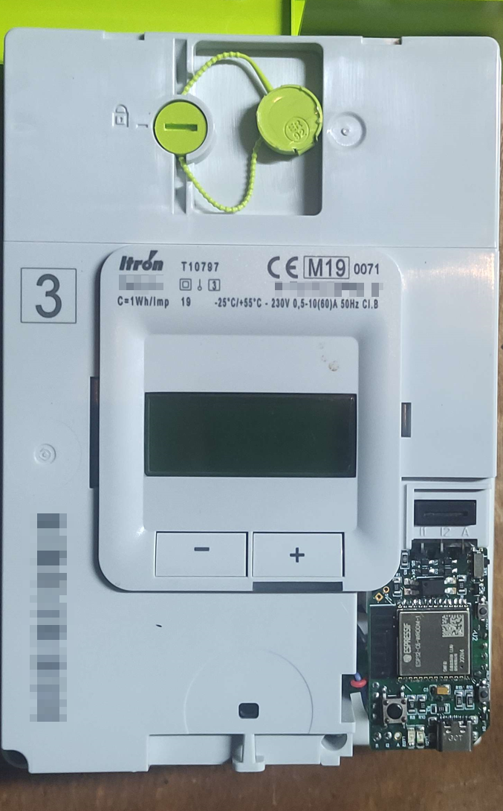

# ESP32 Linky Teleinfo

## About the project

**Linky Teleinfo** is a project to collect data from a **Linky meter** and send them to a **web server** or a *home automation server*. The system is powered by the pins A of the Linky meter and with the help of a supercapacitor.

#### Built With

This project as been created with : 

[](https://code.visualstudio.com/)

- Web

[](https://www.figma.com/)
[](https://sass-lang.com/)
[](https://socket.io/)

[](https://nodejs.org/en/)
[](https://vuejs.org/)
[](https://www.chartjs.org/)

[](https://www.mysql.com/fr/)
[](https://expressjs.com/fr/)
[](https://www.prisma.io/)

- MQTT

[](https://mqtt.org/)
[](https://www.home-assistant.io/)

- Zigbee / Thread / Matter

[](https://en.wikipedia.org/wiki/Zigbee)
[](https://en.wikipedia.org/wiki/Thread_(network_protocol))
[](https://en.wikipedia.org/wiki/Matter_(standard))

- Microcontroller programming 

[](https://www.arduino.cc/)
[](https://www.espressif.com/)

## Electronic


[`esp32/src`](/esp32/src) : The code is made to be sent on an ESP32 on an electronic card

| Top Side | Bottom Side | PCB in the Linky meter |
|-----|-----|-----|
|  |  |  | 

#### Schematic

[`pcb/Schematic_LINKY_ESP32.pdf`](pcb/Schematic_LINKY_ESP32.pdf)

#### PCB


[`pcb/Gerber_PCB_LINKY_ESP32.zip`](pcb/Gerber_PCB_LINKY_ESP32.zip)

| Top Side  | Bottom Side |
| ------------- | ------------- |
|  |  |

## Installation


#### ESP32 :satellite:
Compile and send [`esp32/src`](/esp32/src) files to the ESP32

#### DataBase MySQL :globe_with_meridians:
Create a `Linky` Database
Copy the [.env_sample](/webserver/.env_sample) to `.env` and fill with your database logins

#### WebPage :computer:
Host the website available on [`webserver/`](/webserver)
```bash
cd webserver
#Installation
npm install
npx prisma generate
npx prisma db push
#Start
npm start
```

## Running Tests
Start the system with USB cable and serial monitor opened and you should see

```
Starting...
Connecting to [WIFI_SSID] ...
WiFi connected
IP address: 192.168.43.185
Getting config from server...OK
Getting time from NTP...OK
Disconecting from wifi...OK
Data stored: 0 - BASE:1647
Data stored: 1 - BASE:1647
Data stored: 2 - BASE:1647
Preparing json data... OK
Connecting to [WIFI_SSID] ...
WiFi connected
IP address: 192.168.43.185
Getting config from server...OK
Getting time from NTP...OK
Sending data to server... OK: 200
Disconecting from wifi...OK
```
## Demo

#### Web example


#### MQTT example - Home Assistant


#### Zigbee example - Home Assistant


## Authors

- [@Dorian.local/](https://github.com/xmow49)
- [@Noah_](https://github.com/NoahJst)

[](https://www.youtube.com/gammatroniques)
[](https://gammatroniques.fr/)

>__Note__  
This project is still under development, it is possible that errors and problems are found in the code

:shipit:
